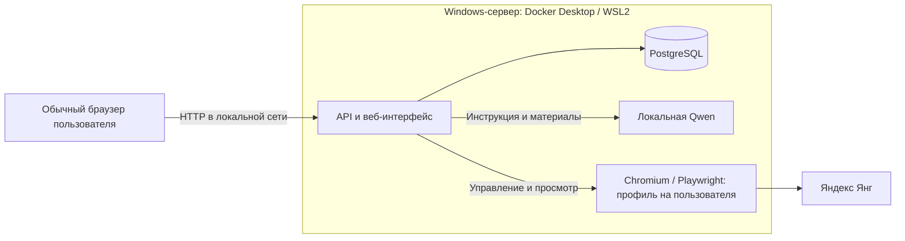

# BrowserSkills — помощник для Яндекс Янг

Серверное приложение с веб-интерфейсом, отдельным Chromium/Playwright для каждого пользователя и локальной мультимодальной моделью. Все рабочие компоненты запускаются через Docker Compose на Windows с Docker Desktop / WSL2. На компьютере пользователя нужен обычный браузер.

Целевой сайт уточнён пользователем: [Яндекс Янг](https://yang.yandex-team.ru/?activeTab=all), с корпоративным входом. Стартовый адрес и название интерфейса исправлены в исходниках; обновлённые образы ещё не развёрнуты на `.107`. Прежние проверки `tasks.yandex.ru` не подтверждают совместимость с Янг.

**Статус: реализация и интеграционная проверка.** Адаптер ещё не подтверждён на авторизованной странице Яндекс Янг: список проверенных рабочих шаблонов пуст. Сейчас промышленный запуск отклонит неподдерживаемый шаблон. Тестовый сайт проверяет механизмы извлечения и отправки, но не доказывает совместимость с настоящим Яндексом. На целевом сервере `192.168.0.107` модель завершила 100 синтетических примеров без ошибок inference и уложилась в ограничения времени, но пороги качества не прошла: текст 88%, изображения 80%, речь 100%, звук/интонация 28%. Подробности и ограничения — в [отчёте проверки](docs/verification.md).

## Как работает приложение

1. Пользователь входит в BrowserSkills и открывает свой серверный браузер через веб-интерфейс.
2. Вручную входит в Яндекс и открывает задание совместимого проекта.
3. Указывает число заданий, от 1 до 50, и начинает запуск.
4. Приложение читает полную инструкцию с примерами и исключениями, затем текст, картинку и/или аудио текущего задания.
5. Модель предлагает один из готовых ответов или отказывается от предложения. Пользователь может выбрать другой вариант, просмотреть картинку и прослушать исходную запись.
6. Только кнопка «Подтвердить и отправить» разрешает отправку конкретного ответа. После проверки результата открывается следующее задание.

Если инструкция или материал изменились, старое подтверждение недействительно. При неопределённом результате отправки приложение показывает `UNKNOWN` и не отправляет тот же ответ повторно. Пользователь проверяет результат непосредственно в Яндексе. Кнопка «Стоп» отменяет дальнейшие действия, но не отменяет уже отправленный ответ.

## Границы первой версии

- До пяти заранее созданных пользователей, каждый со своим Яндекс-аккаунтом и постоянным профилем Chromium; один активный запуск на пользователя.
- Одно задание целиком, один ответ из 2–10 вариантов. Не поддерживаются свободный ввод и несколько вопросов под одной кнопкой отправки.
- Текст, одна картинка и/или одна аудиозапись. Аудио включает речь, звуки, музыку и интонацию: расшифровка текста не заменяет запись.
- Аудио задания — до 60 секунд и 20 МиБ; суммарно с аудиопримерами инструкции — до 120 секунд. Исходник доступен для прослушивания; нормализация применяется только к представлению для модели.
- Полная инструкция обязательна. Недоступные разделы, неподдерживаемые материалы или превышение контекста не отбрасываются молча.
- До 100 анализов на пользователя в сутки UTC. Один запрос выполняется, до четырёх ожидают. Ошибка модели допускает ручной выбор, если задание и инструкция полностью прочитаны.

## Состав

| Каталог | Назначение |
|---|---|
| `apps/api` | Java 21 / Spring Boot: сессии, пользователи, очередь анализа, подтверждения, история и прокси браузера |
| `apps/browser` | Node 24 / Playwright: Chromium, извлечение инструкции и материалов, проверяемая отправка, RFB-мост |
| `apps/web` | React: управление запуском, полная инструкция, плеер, варианты ответа и noVNC |
| `contracts` | Проверяемые схемы HTTP и браузерного протокола |
| `ops` | Docker, подготовка Qwen2.5-Omni-7B / llama.cpp CUDA, оценка модели, Windows-эксплуатация |
| `tests/test-site` | Собственный тестовый сайт; не используется как рабочий адаптер Яндекса |
| `tests/e2e` | Проверки интерфейса и всей связки сервисов |

Контракты и обязательные инварианты описаны в [docs/IMPLEMENTATION.md](docs/IMPLEMENTATION.md). Развёртывание, создание пользователей, резервное копирование и восстановление — в [docs/operations.md](docs/operations.md).



Проверенное поведение и оставшиеся условия приёмки перечислены в [docs/verification.md](docs/verification.md).

## Развёртывание

Следуйте [инструкции эксплуатации](docs/operations.md). Развёртывание на `192.168.0.107` выполняется с компьютера оператора через существующий Docker API `2375`. Проверяются GPU в контейнере, образы, веса модели и пользователи. Установка сертификатов на компьютере пользователя не требуется.

Согласованный рабочий адрес: `http://192.168.0.107:8080`. По явному выбору пользователя соединение внутри локальной сети работает без TLS. Публикуется только порт приложения; база, модель и браузерные порты не публикуются, профили и секреты пользователей раздельные. Автозапуск после входа в Windows и восстановление на целевом сервере ещё требуют проверки.

## Локальные проверки

Нужны Node 24, JDK 21, Maven, FFmpeg/ffprobe в `PATH` и работающий Docker с Linux-контейнерами. `JAVA_HOME` должен указывать на JDK 21. Проверки не требуют входа в настоящий Яндекс и не отправляют туда ответы.

```powershell
npm ci
npm run typecheck
npm run build
npm run test --workspace @browserskills/web
npx playwright install chromium
npm run test:e2e
mvn -f apps/api/pom.xml verify
npm run test:system
docker build -f apps/browser/Dockerfile -t browserskills-browser:local .
npm run test:rfb
npm run test:profile
docker build -f apps/api/Dockerfile -t browserskills-api:local .
npm run test:docker-api
python -m unittest discover -s ops/tests -v
```

Если Chromium установлен в отдельный каталог, перед тестами задайте `PLAYWRIGHT_BROWSERS_PATH`. Браузерные проверки аудио требуют настоящего `ffprobe`; он установлен в браузерном Docker-образе. Подробные команды контейнерных проверок приводятся в документации эксплуатации.

`test:e2e` проверяет веб-интерфейс в Chromium с HTTP-заглушкой сервера. `test:system` запускает временный PostgreSQL, настоящий Spring API, отдельные Chromium и собственный тестовый сайт; модель заменена предсказуемым HTTP-сервисом. `test:rfb` использует производственную сборку интерфейса и дополнительный контейнер с настоящими Xvfb/x11vnc/Chromium, проверяя соединение через Java-прокси и отзыв управления. Пароли тестовых аккаунтов случайные и передаются через stdin/окружение. Временные контейнеры удаляются при завершении теста. Эти проверки не являются оценкой качества Qwen или доказательством поддержки реального шаблона Яндекса.

`test:docker-api` требует PowerShell 7.4 на Windows и проверяет собранный API-образ с настоящей PostgreSQL: HTTP без файлов сертификата, встроенную веб-страницу, HttpOnly/SameSite cookie, CSRF, вход и выход. API работает от обычного пользователя с доступной только для чтения файловой системой. Браузеры и модель в этом тесте недоступны намеренно, что проверяет диагностику частично запущенной системы.

`test:profile` проверяет сохранение cookies и localStorage после остановки и замены контейнера Chromium, включая отсутствие оставшихся блокировок профиля. Полное резервное копирование и восстановление базы с пятью отдельными профилями проверяет `ops/tests/Test-DeploymentRoundtrip.ps1`; подготовка тестового сценария описана в [документации эксплуатации](docs/operations.md).

Для приёмки модели нужен отдельно размеченный набор текстовых, графических, речевых и звуковых заданий. Скрипт оценки и требования к результатам описаны в документации эксплуатации; синтетический диагностический набор не заменяет проверку на материале выбранного проекта.
