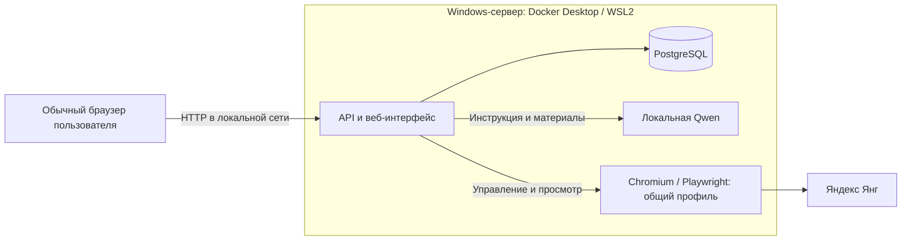

# BrowserSkills — автономный помощник для Яндекс Янг

Серверное приложение с веб-интерфейсом, общим Chromium/Playwright и локальной Qwen. Компоненты работают в Docker на Windows `192.168.0.107`; пользователю нужен обычный браузер и адрес `http://192.168.0.107:8080`. Входа в BrowserSkills нет: все посетители работают в одном пространстве с общими настройками, историей и браузером Янг. Сертификаты и клиентское приложение не требуются.

Целевой сайт — [Яндекс Янг](https://yang.yandex-team.ru/?activeTab=all), корпоративный вход с двухфакторкой. Исполнитель работает с целыми наборами, поддерживает разные поля и исходные текст, изображения и аудио. Подтверждение каждого ответа удалено: после запуска отправка автоматическая, если категория модели допущена по независимой проверке качества.

**Статус проверок и развёртывания:** [verification.md](docs/verification.md). По умолчанию файл допуска пуст: имеющиеся синтетические результаты не подтверждают 90% правильных целых наборов. Недопущенный проект получает причину блокировки; приложение не отправляет предположительные ответы ради продолжения работы.

## Как пользоваться

1. Открыть BrowserSkills и нажать «Подключить Янг».
2. В открывшемся серверном Chromium самостоятельно пройти логин, пароль и второй фактор. Состояние «Янг подключён» определяется автоматически; сессия обычного Chrome/Codex сюда не переносится.
3. Выбрать проект из каталога либо включить автовыбор. По умолчанию он выбирает максимальную сопоставимую указанную цену за целый набор; обучения, экзамены и неизвестная цена исключаются. Можно сохранить фильтры проектов, оплаты и материалов.
4. Задать от 1 до 50 наборов и нажать «Запустить». Интерфейс показывает причину выбора, подготовку инструкции, расход квоты, заполнение и результаты.
5. Если Яндекс повторно запросил вход, пройти его через тот же браузер и нажать «Продолжить». «Стоп» прекращает дальнейшие действия.

В окне серверного браузера есть кнопка **«На весь экран»** и масштаб **«100%»** с прокруткой. Если встроенный браузер запрещает полный экран, панель разворачивается на всё доступное окно. «Свернуть» возвращает обычный вид.

Для вставки выберите поле в Янг и нажмите **Ctrl+V**. Другой способ: открыть **«Буфер обмена»**, вставить текст в «Текст для Янг» и нажать «Вставить в Янг». Для копирования наружу выделите текст внутри Янг, нажмите **Ctrl+C**, затем в панели буфера нажмите **«Скопировать на компьютер»**. Поддерживается обычный текст, включая кириллицу, emoji и переносы строк, до 64 КиБ за раз. Буфер не сохраняется в истории приложения; обмен происходит только во время ручного управления. Сертификаты для этого не нужны.

При изменении инструкции или материалов ответы перестраиваются. Неполная инструкция, неподдерживаемая форма, отказ модели или превышение ресурсов останавливают выполнение без отправки. `UNKNOWN` означает, что результат уже начатой отправки неизвестен: такой набор автоматически повторно не отправляется, даже после перезапуска. SUBMITTED означает подтверждённую отправку, а не выплату или правильность.

## Ограничения

- Одно общее рабочее пространство, постоянный профиль Chromium и один активный запуск. Ручное управление браузером одновременно получает одна сессия посетителя.
- Текст, изображения, аудио; одиночный/множественный выбор, оценки, сравнения, текстовые/числовые ответы и условные поля. Видео, рисование, загрузка файлов и внешние сайты исключены.
- Рабочая запись до 60 с, файл до 20 MiB, суммарное аудио запроса до 120 с. Инструкция обрабатывается полностью порциями; недоступные разделы и примеры блокируют проект.
- Контекст 8192, один выполняемый запрос модели и до 4 ожидающих, 120 с тайм-аут; до 100 фактических вызовов на общее пространство в сутки UTC, включая подготовку инструкции.
- Оригиналы выбранного worker до 960 MiB плюс 64 MiB рабочего API-кеша. Временные материалы удаляются и не входят в резервную копию.

Существующая база, история и профили сохраняются. Общее пространство использует первую ранее назначенную запись и её профиль; данные остальных старых записей остаются в БД и резервных копиях. Пять worker и исторических profile volumes могут сохраняться в инфраструктуре для восстановления; это не пять активных пользователей приложения.

## Состав

| Каталог | Назначение |
|---|---|
| `apps/api` | Java 21 / Spring Boot: общее пространство, управление браузером, очередь анализа, автоматический цикл и история |
| `apps/browser` | Node 24 / Playwright: Chromium, извлечение инструкции и материалов, проверяемая отправка, RFB-мост |
| `apps/web` | React: управление запуском, каталог, подготовка инструкции, плеер, результаты и noVNC |
| `contracts` | Проверяемые схемы HTTP и браузерного протокола |
| `ops` | Docker, подготовка Qwen2.5-Omni-7B / llama.cpp CUDA, оценка модели, Windows-эксплуатация |
| `tests/test-site` | Собственный тестовый сайт; не используется как рабочий адаптер Яндекса |
| `tests/e2e` | Проверки интерфейса и всей связки сервисов |

Контракты и обязательные инварианты описаны в [docs/IMPLEMENTATION.md](docs/IMPLEMENTATION.md). Развёртывание, резервное копирование и восстановление — в [docs/operations.md](docs/operations.md).



Проверенное поведение и оставшиеся условия приёмки перечислены в [docs/verification.md](docs/verification.md).

## Развёртывание

Следуйте [инструкции эксплуатации](docs/operations.md). Развёртывание на `192.168.0.107` выполняется с компьютера оператора через существующий Docker API `2375`. Проверяются GPU в контейнере, образы, веса модели и постоянный профиль общего пространства. Установка сертификатов на компьютере пользователя не требуется.

Согласованный рабочий адрес: `http://192.168.0.107:8080`. По явному выбору пользователя соединение внутри локальной сети работает без TLS и без авторизации BrowserSkills. Публикуется только порт приложения; база, модель и браузерные порты не публикуются, приватные токены worker сохраняются. Автозапуск после входа в Windows и восстановление на целевом сервере ещё требуют проверки.

## Локальные проверки

Нужны Node 24, JDK 21, Maven, FFmpeg/ffprobe в `PATH` и работающий Docker с Linux-контейнерами. `JAVA_HOME` должен указывать на JDK 21. Проверки не требуют входа в настоящий Яндекс и не отправляют туда ответы.

```powershell
npm ci
npm run typecheck
npm run build
npm run test --workspace @browserskills/web
npx playwright install chromium
npm run test:e2e
mvn -f apps/api/pom.xml verify
npm run test:system
docker build -f apps/browser/Dockerfile -t browserskills-browser:local .
npm run test:rfb
npm run test:profile
docker build -f apps/api/Dockerfile -t browserskills-api:local .
npm run test:docker-api
python -m unittest discover -s ops/tests -v
```

Если Chromium установлен в отдельный каталог, перед тестами задайте `PLAYWRIGHT_BROWSERS_PATH`. Браузерные проверки аудио требуют настоящего `ffprobe`; он установлен в браузерном Docker-образе. Подробные команды контейнерных проверок приводятся в документации эксплуатации.

`test:e2e` проверяет веб-интерфейс в Chromium с HTTP-заглушкой сервера. `test:system` запускает временный PostgreSQL, настоящий Spring API, Chromium и собственный тестовый сайт; модель заменена предсказуемым HTTP-сервисом. `test:rfb` использует производственную сборку интерфейса и дополнительный контейнер с настоящими Xvfb/x11vnc/Chromium, проверяя соединение через Java-прокси и отзыв управления. Временные контейнеры удаляются при завершении теста. Эти проверки не являются оценкой качества Qwen или доказательством поддержки реального шаблона Яндекса.

`test:docker-api` требует PowerShell 7.4 на Windows и проверяет собранный API-образ с настоящей PostgreSQL: HTTP без файлов сертификата, встроенную веб-страницу и API общего пространства. CSRF и cookie сессии управления сохраняются без входа в приложение. API работает от обычного пользователя с доступной только для чтения файловой системой. Браузеры и модель в этом тесте недоступны намеренно, что проверяет диагностику частично запущенной системы.

`test:profile` проверяет сохранение cookies и localStorage после остановки и замены контейнера Chromium, включая отсутствие оставшихся блокировок профиля. Полное резервное копирование и восстановление базы с пятью историческими профилями проверяет `ops/tests/Test-DeploymentRoundtrip.ps1`; этот сценарий сохраняет старые данные и не означает наличие пяти рабочих пространств. Подготовка тестового сценария описана в [документации эксплуатации](docs/operations.md).

Для приёмки модели нужен отдельно размеченный набор текстовых, графических, речевых и звуковых заданий. Скрипт оценки и требования к результатам описаны в документации эксплуатации; синтетический диагностический набор не заменяет проверку на материале выбранного проекта.
